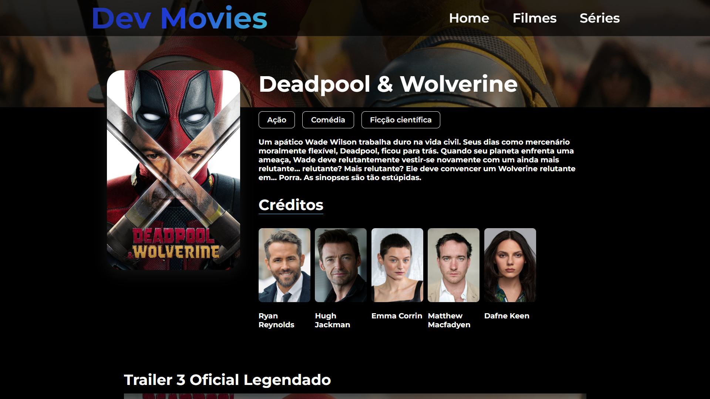
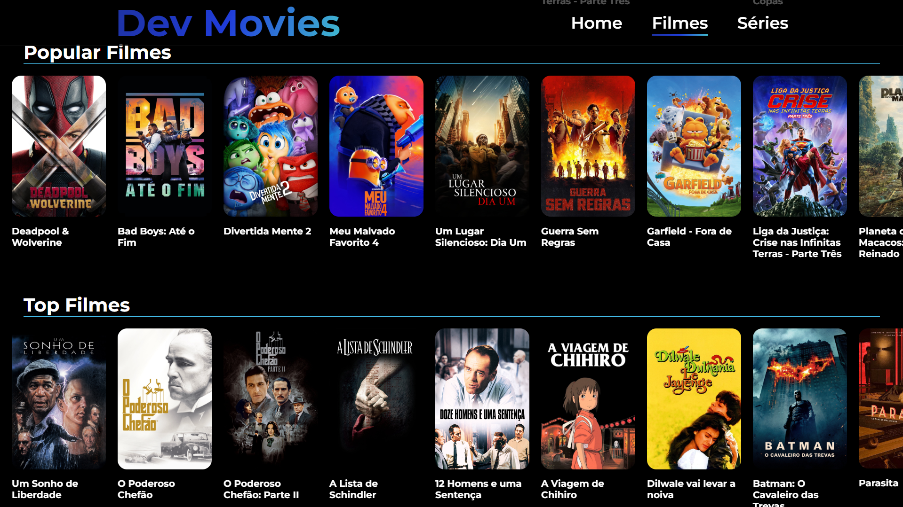
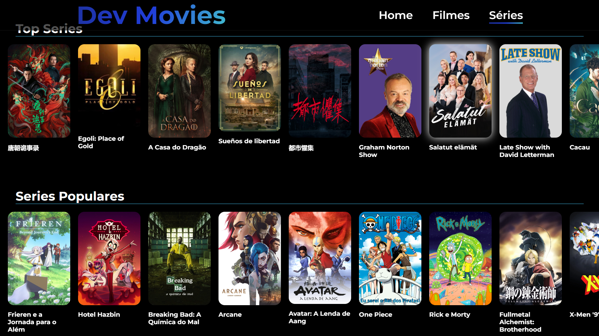

# Dev Movies

## Índice

- [Visão Geral](#visão-geral)
  - [Imagens](#Imagens)
- [Funcionalidades](#funcionalidades)
- [Tecnologias Utilizadas](#tecnologias-utilizadas)
- [Começando](#começando)
  - [Pré-requisitos](#pré-requisitos)
  - [Instalação](#instalação)
  - [Executando o Projeto](#executando-o-projeto)
- [Deploy](#deploy)
- [Contribuindo](#contribuindo)
- [Contato](#contato)

## Visão Geral

Este é um projeto de catálogo de filmes construído usando React.js. O Dev Movies permite que os usuários visualizem uma lista de filmes, vejam detalhes de cada filme e pesquisem filmes por título. Você pode ver a versão ao vivo do projeto.
[Dev Movies](dev-movies-lyart.vercel.app)

## Imagens

Aqui estão algumas imagens do projeto:

<div>
    
    
    
    
</div>

## Funcionalidades

- Visualizar lista de filmes
- Ver detalhes de cada filme
- Pesquisar filmes por título
- Design responsivo

## Tecnologias Utilizadas

- [React.js](https://reactjs.org/)
- [Vite](https://vitejs.dev/)
- [Axios](https://axios-http.com/)
- [styled-components](https://styled-components.com/)
- [API de filmes (developers.themoviedb.org)](https://developer.themoviedb.org/docs/getting-started)

## Começando

### Pré-requisitos

- Node.js (v14.x ou superior)
- npm

### Instalação

1. Clone o repositório:

   ```bash
   git clone https://github.com/DalioSY/dev-movies.git
   ```

2. Navegue até o diretório do projeto:

   ```bash
   cd dev-movies
   ```

3. Instale as dependências:

   ```bash
   npm install
   ```

4. Crie um arquivo .env na raiz do projeto e adicione a chave da API de filmes:

   ```bash
   VITE_MOVIE_API_KEY
   ```

### Executando o Projeto

1. Inicie o servidor de desenvolvimento:

   ```bash
   npm run dev
   ```

2. Abra [http://localhost:5173](http://localhost:5173) no seu navegador para ver o projeto.

## Deploy

Este projeto está implantado usando Vercel. Para implantar sua própria versão, você pode seguir estas etapas:

1. Envie seu código para um repositório no GitHub.
2. Vá para [Vercel](https://vercel.com/) e crie um novo projeto.
3. Conecte seu repositório GitHub.
4. Implante seu projeto.

## Contribuindo

Contribuições são bem-vindas! Por favor, siga estas etapas para contribuir:

1. Faça um fork do repositório.
2. Crie uma nova branch (`git checkout -b feature/SuaFuncionalidade`).
3. Faça suas alterações.
4. Faça um commit das suas alterações (`git commit -m 'Adicionei uma nova funcionalidade'`).
5. Envie para a branch (`git push origin feature/SuaFuncionalidade`).
6. Crie um novo Pull Request.

## Contato

- **Dalio Shindi Yamada**
- [GitHub](https://github.com/DalioSY)
- [LinkedIn](https://www.linkedin.com/in/dalio-s-yamada)
- [Portfólio](https://daliosy.github.io/my-PORTFOLIO)
